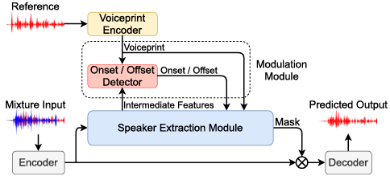
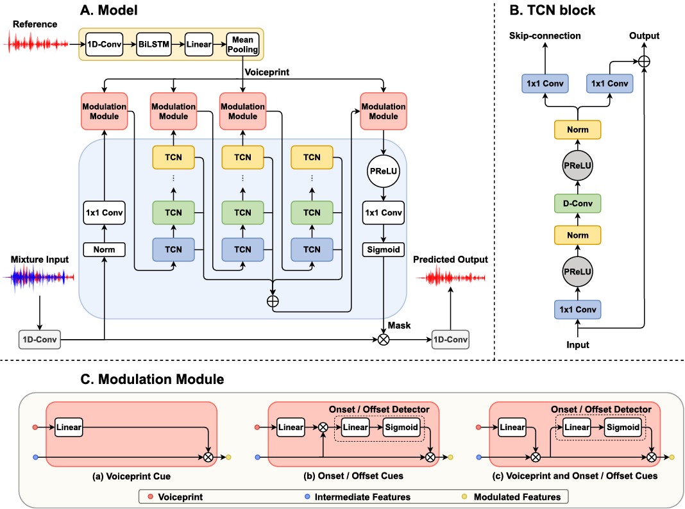
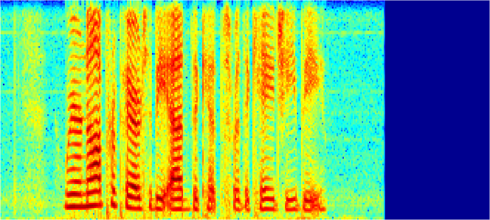
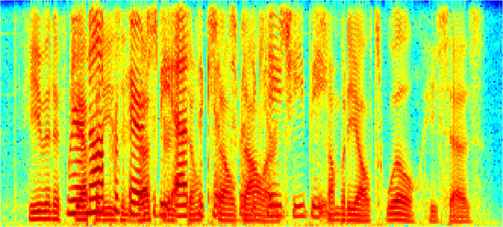
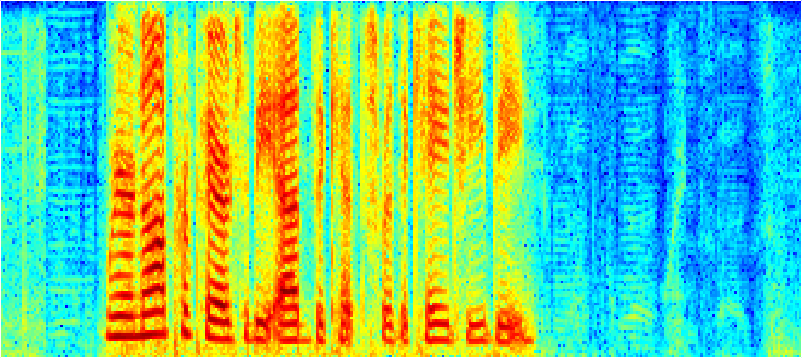

# WASE

## Overview

Implementation of our paper [Wase: Learning When to Attend for Speaker Extraction in Cocktail Party Environments](https://ieeexplore.ieee.org/document/9413411). WASE first explicitly models **start/end time of speech** (**onset/offset cues**) in speaker extraction problem.



## Model

WASE is adapted based on our previous proposed [framework](http://www.interspeech2020.org/uploadfile/pdf/Mon-3-11-6.pdf), which includes five modules: voiceprint encoder, onset/offset detector, speech encoder, speech decoder, and speaker extraction module.

In this work, we focus on the onset/offset cues of speech and verify their effectiveness in speaker extraction task. We also combine the onset/offset cues and voiceprint cue. Onset/offset
cues model start/end time of speech and voiceprint cue models the
voice characteristics. The combination of two perceptual cues bring a significant performance improvement, while extra needed parameters are negligible. Please see the figure below for detailed model structure.


***************************************************************

## Datasets
* [WSJ0](https://catalog.ldc.upenn.edu/LDC93S6A)

## Dependencies
* Python 3.7
* Pytorch 1.0.1
* pysoundfile 0.10.2
* librosa 0.7.2
* Please refer to environment.yml for details.

***************************************************************
## Getting Started
### Modify dataset path
The training samples are generated by randomly selecting speeches of different speakers from *si_tr_s* of WSJ0, and mixing them at various signal-to-noise ratios (SNR). The evaluating samples are generated by fixed list *./data/wsj/mix_2_spk_voiceP_tt_WSJ.txt*. Please modify the dataset path in *./data/preparedata.py* according to your actual path.
```python
data_config['speechWavFolderList'] = ['/home/aa/WSJ/wsj0/si_tr_s/']
data_config['spk_test_voiceP_path'] = './data/wsj/mix_2_spk_voiceP_tt_WSJ.txt'
```
You may need the command below to modify the evaluating data path.
```bash
sed -i 's/home\/aa/YOUR PATH/g' data/wsj/mix_2_spk_voiceP_tt_WSJ.txt
```
We advise you to utilize the pickle file, which could speed up experiments by saving time for frequency resampling. You could modify the pickle path to anywhere you like.
```python
data_config['train_sample_pickle'] = '/data1/haoyunzhe/interspeech/dataset/wsj0_pickle/train_sample.pickle'
data_config['test_sample_pickle'] = '/data1/haoyunzhe/interspeech/dataset/wsj0_pickle/test_sample.pickle'
```
### Run the demo
Simply run this command:
```bash
python eval.py
```
This will load the model `onset_offset_voiceprint.pt` and verify its performance. It will cost about an hour.

PS. The default setting is using both onset/offset and voiceprint cues. If you want to train a model based on only onset/offset cues or voiceprint cue, please modify the parameters in config.yaml.

```yaml
ONSET: 1
OFFSET: 1
VOICEPRINT: 1
```

### Training

```bash
python train.py
```

### Evaluation

```bash
python eval.py
```

### View tensorboardX

```bash
tensorboard --logdir ./log
```
*******************************************************************

## Result

### Audio Sample

<!-- - Listen to audio sample at webpage: http://swpark.me/voicefilter/ -->
- Listen to audio samples at [*./assets/demo*](./assets/demo).
- Spectrogram samples (clean/mixture/prediction).
<div  align="center">    

<br>

<br>

</div>

### Metric

| Methods             | #Params | SDRi(dB) |
| ---------------------- | ----- | ---- |
| [SBF-MTSAL](https://ieeexplore.ieee.org/document/8683874)   |  19.3M  |  7.30 |
| [SBF-MTSAL-Concat](https://ieeexplore.ieee.org/document/8683874)      | 8.9M  | 8.39 |
| [SpEx](https://ieeexplore.ieee.org/document/9067003)      | 10.8M  | 14.6 |
| [SpEx+](https://arxiv.org/abs/2005.04686)      | 13.3M  | 17.2 |
| WASE (onset / offset + voiceprint)      | 7.5M   | 17.05 |

### If you want to reproduce the results above, you need to decay learning rate and freeze voiceprint encoder in config.yaml when the model is close to convergence.

```yaml
FREEZE_VOICEPRINT: 0
learning_rate:  0.001
```

## Citations

If you find this repo helpful, please consider citing:

```
@inproceedings{hao2021wase,
  title={Wase: Learning When to Attend for Speaker Extraction in Cocktail Party Environments},
  author={Hao, Yunzhe and Xu, Jiaming and Zhang, Peng and Xu, Bo},
  booktitle={ICASSP 2021-2021 IEEE International Conference on Acoustics, Speech and Signal Processing (ICASSP)},
  pages={6104--6108},
  year={2021},
  organization={IEEE}
}
```

```
@inproceedings{hao2020unified,
  title={A Unified Framework for Low-Latency Speaker Extraction in Cocktail Party Environments},
  author={Hao, Yunzhe and Xu, Jiaming and Shi, Jing and Zhang, Peng and Qin, Lei and Xu, Bo},
  booktitle={Proc. Interspeech 2020},
  pages={1431--1435},
  year={2020}
}
```
For more detailed descirption, you can further explore the whole paper with [this link](https://doi.org/10.1109/ICASSP39728.2021.9413411).  

## License

For commercial use of this code and models, please contact: Yunzhe Hao(haoyunzhe2017@ia.ac.cn).

This repository contains codes adapted/copied from the followings:
- [./models/tasnet.py](./models/tasnet.py) from [Conv-TasNet](https://github.com/naplab/Conv-TasNet) (CC BY-NC-SA 3.0);
- [./models/tcn.py](./models/tcn.py) from [Conv-TasNet](https://github.com/naplab/Conv-TasNet) (CC BY-NC-SA 3.0).
